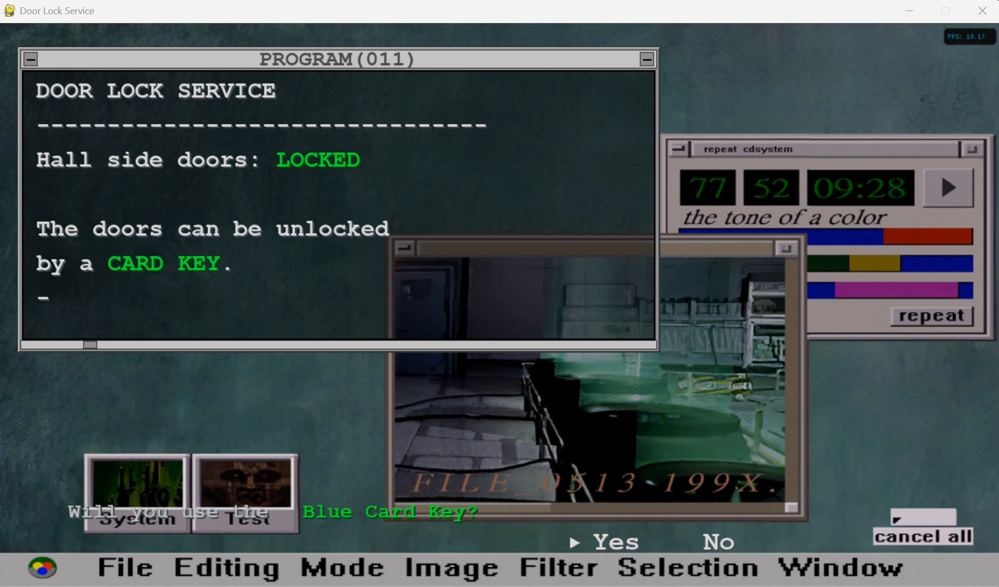
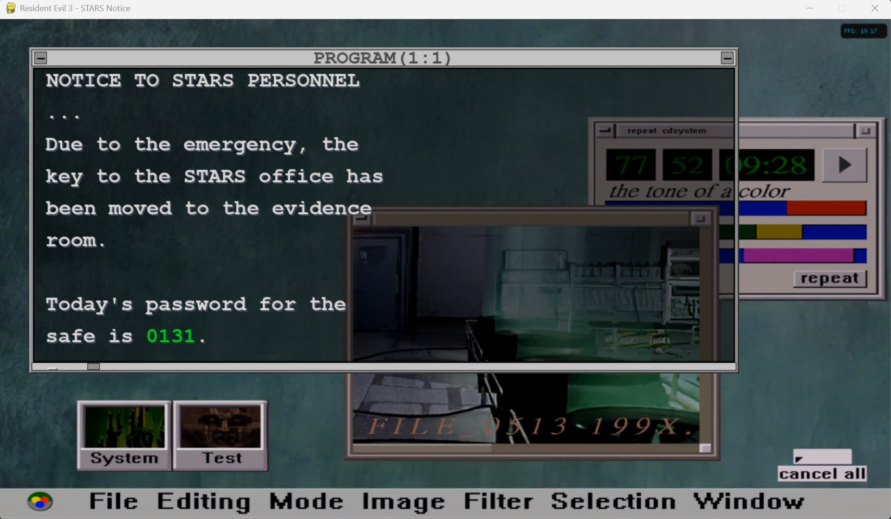

# Resident evil 2 & 3 PC Access 🔒

A fun simulation inspired by *Resident evil 2 & 3* main PC access for unlock RPD doors.




---

## 🚀 Installation & Usage
### **1️⃣ Install Dependencies**
Make sure you have Python 3 installed, then install required packages:

```bash
sudo apt install -yqq python3-tk python3.10-venv

python3.10 -m venv nedrytest
source nedrytest/bin/activate
pip install -r requirements.txt
```
**Note**: Only tested in Ubuntu/Debian distros.


### **2️⃣ Run the Program**
`
python main.py
`

### **3️⃣ Deactivate Virtual Environment when finished**
`
deactivate
`

### Wintel usage
```powershell
    python.exe -m venv wintel

    Set-ExecutionPolicy -ExecutionPolicy RemoteSigned -Scope Process

    .\wintel\Scripts\Activate.ps1

    pip install -r requirements.txt

    python re2_skycard.py

    python re3_notice.py
```